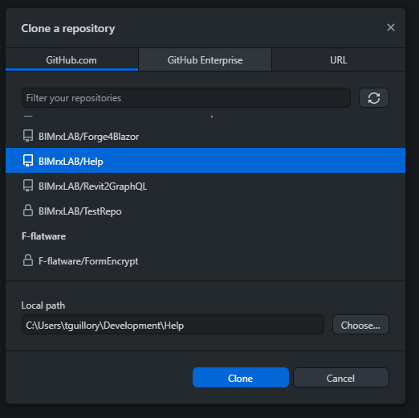
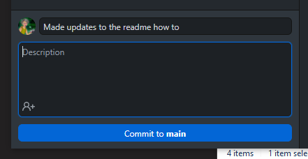
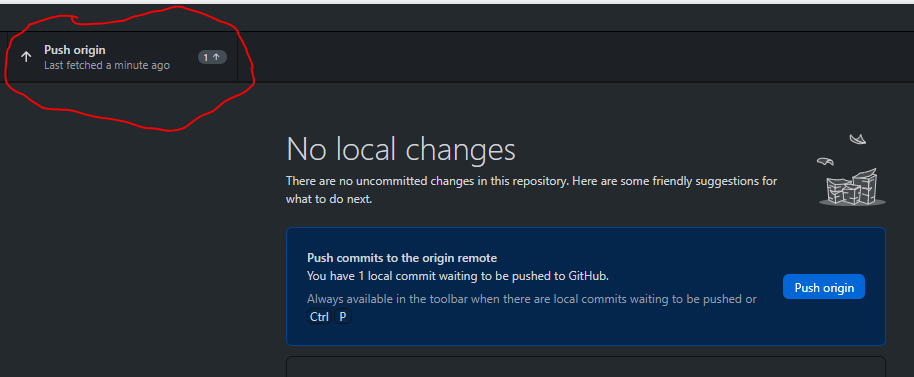

# HOW TO Update Help

## Structure

The repo stores all versions of the help for all products and languages. The root level of the repo is **not** displayed on the website and is where this README is stored. Be aware this repo is public and you should **not** store ANY files or documentation in this repo that should not be made available publicly.

+ root
    + docs
        + index.html
        + CloudManager
            + version
                + ENU
        + Revit
            + version
                + ENU

The `docs` folder is the root level of the website at [https://help.bimrx.com](https://help.bimrx.com)

If you wish to create additional root level web pages such as a `faq.html` you can add it to the `docs` folder

## Steps

1. Export updated Help from HelpNDoc to a new local folder of the product/version/language
1. Clone this repo locally using your favorite Git Tool. [GitHub Desktop](https://desktop.github.com/) is specifically geared toward GitHub, avaliable on several platforms and very easy to use. 
    * Select `File -> Clone Repository`

1. Create a new corresponding folder for the help update using the **(product/version/language**) tuple structure.
1. Copy the exported HelpNDoc HTML files over to their destination in the repo locally.
1. Add a comment about what changes you made and commit locally.

1. Push your changes to the remote repo on GitHub.

## Branches

The main branch is simply called **main**. And changes made to the main branch will be reflected on the website almost immediately. There is a few minutes where the pipeline will run upon pushing to copy the files over. After that you can do a hard/forced refresh on the help website to see the changes.

Feel free to make a branch before making any changes. However, you will need to merge back into **main** for your changes to be displayed on the website.
